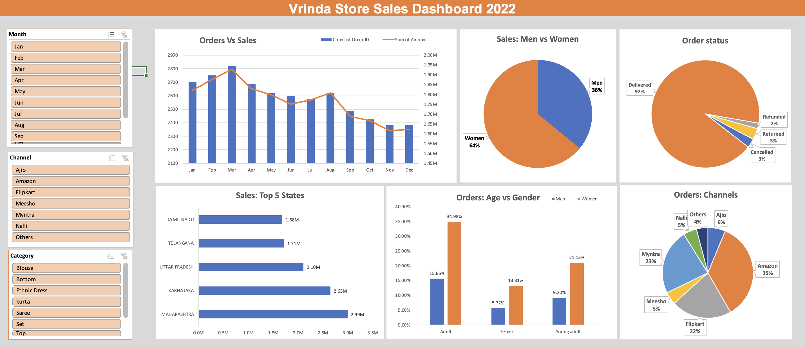

# Store Sales Analysis(Excel data analysis project)
### Project Overview
To analyze Vrinda Store's 2022 sales data, uncover trends, and provide actionable insights. Vrinda store aims to understand their customers and sales performance to improve their sales in 2023.
### Data Overview
* Dataset: Monthly sales data including product categories, revenue, and customer data.
* Sheets:
   - Vrinda Store 2022: Raw data for the year 2022.
   - Pivot Table: Aggregated metrics for analysis.
   - Dashboard: Visualization summarizing performance.
### Analysis Steps
* Data cleaning
  - Verified data accuracy and handled missing values.
  - Standardized category names and ensured proper formatting.
    
* Exploratory Data Analysis
  - Comparison between order count and revenue.
  - Which month got the highest sales and orders?
  - Who purchased more: men or women in 2022?
  - What are the different order statuses in 2022?
  - Which are the top 10 states contributing to the sales?
  - Relation between age and gender based on count of orders.
  - Which channel is contributing the most in terms of sales?
  - Highest selling category?
* Dashboard
   

### Results/Findings
* Women are more likely to buy compared to men (~65%)
* Maharashtra, Karnataka and Uttar Pradesh are the top 3 states contributing to sales.
* Adult within the age group (30-49 yrs) are the main customers.
* Amazon, Flipkart and Myntra channels generate the most revenue.

### Recommendation
* Target women customers of age group (30-49 yrs) living in Maharashtra, Karnataka and Uttar Pradesh by showing ads/offers/coupons available on Amazon, Flipkart and Myntra.
  

